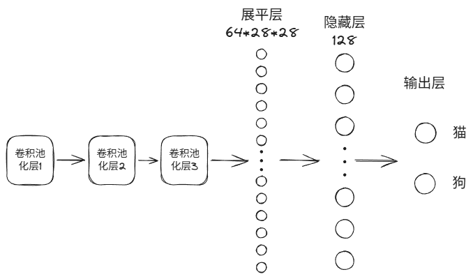

# 猫狗大战分类模型 (DogsVsCats)

## 概述
---
本项目是一个基于 **PyTorch** 的二分类图像识别模型，包含一个 **自定义的三层卷积神经网络** 和迁移过来的 **ResNet-18** 网络。源于Kaggle上的一个挑战(https://www.kaggle.com/c/dogs-vs-cats-redux-kernels-edition)，经过修改最终包含猫与狗的图片共24000张的数据集以及1000张图片的测试集。本人意在通过该项目掌握基础的Pytorch语法、神经网络的搭建以及迁移学习。
## 目录结构
---
```text
DogsVsCats/
├── dataset/                  # 数据集存放目录 (需自行下载并放置)
│   ├── train/                # 原始训练集 (包含 cat 和 dog 文件夹)
│   └── new_test/             # 划分出的测试集 (由 split_test_utils.py 生成)
├── logs/                     # 训练和测试日志自动保存目录
├── weights/                  # 模型权重保存目录
│   ├── cat_dog_CNN_model.pth # 自定义CNN模型权重
│   └── cat_dog_ResNet_model.pth # ResNet-18模型权重
├── Utils/                    # 工具包目录
│   ├── config_utils.py       # 集中管理所有超参数和路径配置
│   ├── split_test_utils.py   # 测试集随机抽样隔离脚本
│   └── logger_utils.py       # 日志记录器封装
├── CNN_train.py              # 自定义 3 层 CNN 训练脚本
├── ResNet_train.py           # ResNet-18 迁移学习训练脚本
├── Predict.py                # 模型评估与测试脚本
├── requirements.txt          # 项目依赖清单
└── README.md                 # 项目说明文档
```
## 数据集
---
本项目使用了 Kaggle 的 [Dogs vs. Cats 数据集](https://www.kaggle.com/competitions/dogs-vs-cats-redux-kernels-edition/data) 中的训练集，由于初始测试集无标签，该项目对原有 25000 张训练集进行修改，随机分配（随机种子为42）猫狗各500张图片用于测试集，剩余图片按 80% 训练集， 20% 测试集的比例进行随机分配。

- **训练集**: 19200 张图片 
- **验证集**: 4800 张图片
- **测试集**: 1000 张图片
- **数据预处理**: 统一缩放至 224x224，并进行了随机水平翻转等数据增强操作。
## 环境依赖 
---
该项目所需环境标注在 **requirements.txt** 中，如下所示： 
```python 
python >= 3.8 torch >= 1.9.0 torchvision scikit-learn torch-directml
```
## 模型架构
---
 **自定义的 3 层卷积神经网络** 结构大致如图所示：
 
 
此外 **ResNet-18** 网络结构在此不做介绍，该项目将此网络的最后一个全连接层替换为输出为2的全连接层，用以二分类。

- 损失函数: 交叉熵 CrossEntropyLoss
- 优化器: 经典的 SGD 优化器
## 训练结果
---
由于早停机制自动终止，自定义模型经过 48 个 Epoch 的训练，在验证集上达到了 **85.1%** 的准确率，在测试集上达到了 **86.1%** 的准确率。

另外作为对比，**ResNet-18** 经过 3 个 Epoch 的训练，在验证集上达到 **97.73%** 的准确率，在测试集上达到了 **98.2%** 的准确率。

具体训练日志见 **/logs** 。
## 快速部署
---
### 1. 克隆项目

将项目克隆到本地（请确保你已经安装了 Git）：
```Bash
git clone [https://github.com/nbplus12345/DogsVsCats.git](https://github.com/nbplus12345/DogsVsCats.git)
cd DogsVsCats
```
### 2. 配置环境

建议使用 Anaconda 创建虚拟环境。本项目特别加入了 `torch-directml` 以支持在 Windows 系统下使用非 NVIDIA 显卡（如 AMD/Intel 核显）进行加速。
```Bash
# 安装所需依赖
pip install -r requirements.txt
```
### 3. 数据准备

1. 从 Kaggle 下载 [Dogs vs. Cats 数据集](https://www.kaggle.com/competitions/dogs-vs-cats-redux-kernels-edition/data)。
2. 在 **dataset** 文件夹下创建 **cat** 与 **dog** 的文件，再将解压后的训练集图片手动分离至各自文件夹（确保结构为 `dataset/train/cat/` 和 `dataset/train/dog/`）。
3. 运行 **split_test_utils.py** ，自动抽取出 1000 张图片作为独立的测试集：
```Bash
python split_test_utils.py
```
### 4. 模型训练

本项目已将超参数与核心代码解耦。可以直接使用默认参数一键运行，更推荐通过命令行动态传入参数来进行调优实验（使用 `-h` 可查看所有支持的参数）。

**训练自定义 CNN 模型：**
```Bash
python CNN_train.py --lr 0.001 --momentum 0.9 --batch_size 32 --epochs 100 --patience 5
```

**训练 ResNet-18 模型：**
```Bash
python ResNet_train.py --lr 0.001 --momentum 0.9 --batch_size 32 --epochs 50 --patience 3
```

_(训练过程中会自动触发早停机制，并将最佳权重保存至 `weights/` 目录下，同时在 `logs/` 目录生成训练日志。)_

### 5. 模型测试与评估

模型训练完成后，可以使用隔离出的 `new_test` 测试集来评估模型准确率。你可以通过命令行参数指定要测试的模型：

**测试 ResNet-18 模型：**
```Bash
python Predict.py --model_name cat_dog_ResNet_model --batch_size 32
```

**测试自定义 CNN 模型：**
```Bash
python Predict.py --model_name cat_dog_CNN_model --batch_size 32
```
## 后续计划 (To-Do)
---
- [ ] 引入分层抽样，保证训练集各类公平，防止偏科
- [ ] 在模型的保存上采用 Top-K 保存策略，引入断点续训
- [ ] 尝试更多的图像增强方法 (如 Cutout)
- [ ] 代码工业化，包括分类更详细的目录和配置与代码解耦等